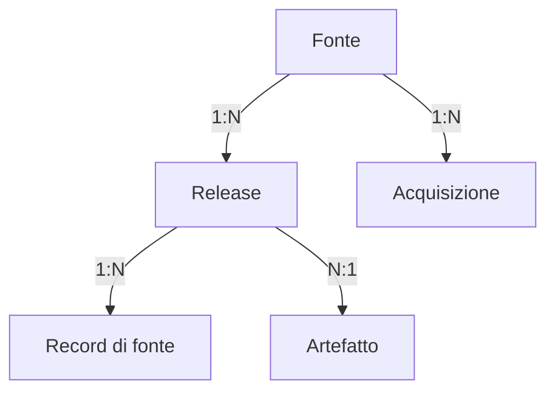
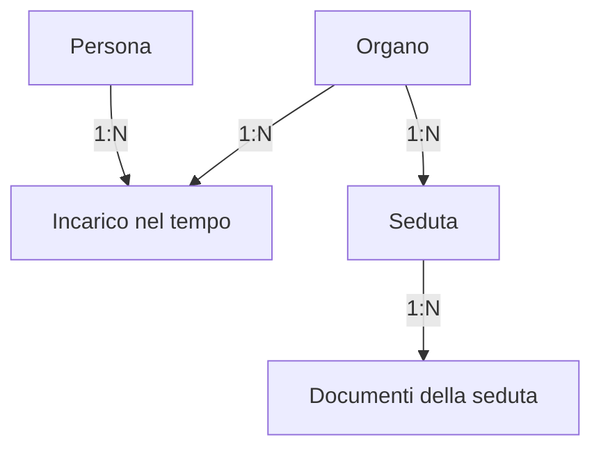
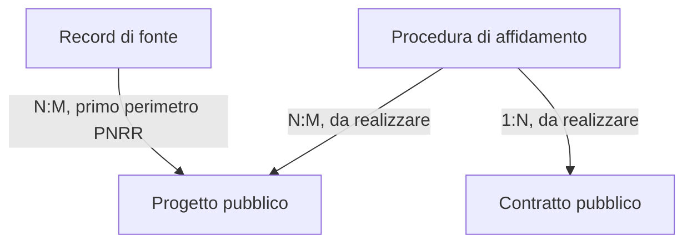

# Disegno concettuale del database

Revisione concettuale del 7 settembre 2026 (#1115), aggiornata l’8 settembre con la [migrazione canonica PNRR](pnrr-canonical-model.md) (#1118). Questo documento è il punto di ingresso corrente. Il [catalogo completo](conceptual-catalog.md) deriva dallo stesso registro usato dall’Archivio interno; gli [esiti dell’assessment](conceptual-assessment-2026-09-07.md) distinguono struttura, contenuti presenti e lavoro residuo.

## I tre livelli

| Livello | Domanda | Fonte di verità |
| --- | --- | --- |
| Concettuale | Quale oggetto rappresentiamo e come lo distinguiamo dagli altri? | `conceptualCatalog` in `architecture/data-domain-registry.v1.json`, definizioni, identità e relazioni |
| Logico | Quale tabella conserva entità, record di fonte, associazione o proiezione? | Mappa delle 75 tabelle nel medesimo registro, con granularità esplicita |
| Fisico | Quali colonne, tipi, PK, FK, vincoli e indici esistono? | `lib/db/src/schema`, migrazioni versionate e catalogo PostgreSQL effettivo nell’Archivio interno |

Il profilo RDF pubblico è una rappresentazione interoperabile di una parte del dominio. Non è il catalogo delle tabelle e non descrive ancora tutti i contenuti del sito. I nomi dei domini nel catalogo sono raggruppamenti, non nuovi schemi SQL.

## Identità e fonte

Una **fonte** pubblica informazioni; una **release** ne fissa una versione; un **record di fonte** è un’unità dentro quella versione. L’**artefatto** conserva i byte e la loro provenienza. Un tentativo di **acquisizione** può fallire o non produrre alcuna nuova release.

Il registro `source_*` implementa questo nucleo per gli snapshot di repository previsti dal manifest. Non è ancora un importatore universale delle fonti esterne. Gli artefatti attuali sono identificati fisicamente da endpoint e hash; hash uguale non autorizza a cancellare la provenienza di un altro endpoint.

L’**identità canonica** è già predisposta in `canonical_subjects`, con `legacy_subject_map` per i riferimenti legacy. Non va introdotto un secondo registro parallelo chiamato `entities`. Il soggetto canonico è un riferimento stabile: le proprietà del progetto, della persona o dell’evento restano tipizzate nel dominio. Erano vuote nello snapshot del 7 settembre; la migrazione PNRR introduce il primo backfill verificato e ne rende visibile la copertura nell’Archivio interno.

Un record può descrivere più entità, non descriverne alcuna o restare irrisolto. Identificatori qualificati, fonte, metodo ed eventuale revisione devono sostenere il collegamento; somiglianza del titolo o del nome non è una regola di fusione.

## Atto, documento e pubblicazione

| Concetto | Identità | Rappresentazione attuale |
| --- | --- | --- |
| Atto | Autorità, tipo, numero e data verificati | `acts` è una struttura legacy; `fundamental_acts` è una selezione redazionale |
| Documento | Contenuto documentale, distinto da formato e copia | Allegati JSON e tabelle documentali specifiche; manca un registro universale |
| Pubblicazione | Fonte e identificativo di pubblicazione | `publications`; contiene anche metadati, allegati ed estrazioni |

Nel modello target una pubblicazione può riguardare più atti e uno stesso atto può essere ripubblicato; più documenti possono documentare un atto e uno stesso documento può riguardare più atti. Queste relazioni N:M non sono oggi integralmente materializzate. PDF, testo estratto e scheda di pubblicazione non devono diventare tre atti canonici.

`lt:AdministrativeAct` nel profilo pubblico corrente descrive il record amministrativo pubblicabile; il mapping verso la distinzione giuridica atto/documento è quindi dichiarato **parziale**. Questa revisione non cambia retroattivamente il significato degli IRI pubblici.

## Persone, organi e incarichi

Il diagramma esprime le responsabilità concettuali; l’implementazione è parziale. `officials` incorpora attributi di ruolo; `organi_members` rappresenta l’appartenenza nel tempo. Occorre risolvere la persona e conservare più incarichi, intervalli e fonti, senza sovrascriverli con la sola carica corrente. Un organo e la persona che lo presiede hanno identità diverse. La seduta non coincide con il verbale o il singolo intervento.

## Progetti e contratti

`attuazione_pnrr_projects` e `italiadomani_projects` sono rappresentazioni per fonte del medesimo tipo di oggetto. La prima è identificata da `source_id`; la seconda dal CUP nel suo schema attuale. Il progetto canonico in `project_projects` usa un UUIDv7, identificatori qualificati in `project_identifiers` e scelte dei valori sostenute da asserzioni; mantiene versioni e divergenze di fonte. La mancanza di CUP non deve eliminare il record sorgente.

Procedura, lotto, aggiudicazione, contratto e pagamento hanno granularità diverse. Il CIG collega informazioni della procedura o del lotto, ma non identifica indistintamente ogni contratto, pagamento e menzione. `contracts` è ancora una riga monolitica da armonizzare; il modello di dettaglio di lotti, parti ed eventi finanziari appartiene alla fase appalti del piano esistente.

## Misure, luoghi e contenuti civici

- **Indicatore → serie → osservazione**: la definizione della misura è distinta dalle dimensioni della serie e dal valore riferito a periodo e release. Il pattern demografico è già strutturato; la sua generalizzazione agli altri indicatori è da completare. Zero, sconosciuto e non applicabile devono restare distinti.
- **Luogo → rappresentazione geografica**: il luogo ha identità propria; geometria, fonte, sistema di riferimento, precisione e versione lo descrivono. I luoghi attestati di un evento non equivalgono a un territorio con rischio attribuito.
- **Segnalazione → monitoraggio**: la prima è un contributo ricevuto; la seconda è una scheda curata con verifiche. Nessuna segnalazione diventa automaticamente un fatto accertato.
- **Intervento → valutazione**: uno strumento di politica pubblica può avere più studi. La proposta civica locale è un ulteriore oggetto con autore, fonti e revisioni.
- **Classificazione**: temi civici, categorie editoriali e categorie di performance sono schemi diversi. Devono avere codici e corrispondenze esplicite, non una fusione basata sull’etichetta.
- **Eventi ed evidenze**: conservare i vincoli LTCEDS, gli stati probatori, la provenienza delle qualificazioni e la proiezione pubblica separata. Raggruppamenti e ricorrenze non attribuiscono responsabilità.

Le cardinalità nel catalogo sono massime; l’assenza di un collegamento resta consentita finché non esiste evidenza sufficiente. `implemented` riguarda la struttura di un dominio, non una copertura universale o la presenza di dati.

## Decisioni fisiche e passaggio graduale

La revisione del 7 settembre riguardava mapping e presentazione. L’aggiornamento PNRR aggiunge cinque tabelle con migrazioni versionate `0021` e `0022`, backfill controllato e indici per vincoli, identificatori e storia. I tipi, gli indici e le FK effettivi restano ispezionabili; il catalogo delle 75 tabelle non viene sostituito da una tabella generica di attributi.

Per le successive migrazioni: aggiungere prima strutture tipizzate e ponti verso l’identità esistente; eseguire backfill idempotenti con record irrisolti espliciti; riconciliare conteggi e campi per fonte/versione; verificare le letture API; infine convertire i vecchi modelli in proiezioni di compatibilità. La dismissione richiede assenza di scritture legacy e nessuna perdita di evidenza. Non rinominare tabelle solo per farle assomigliare al menu.

PK e vincoli univoci devono esprimere l’identità alla granularità corretta; le FK devono collegare oggetti compatibili. Nuovi indici richiedono query e carichi misurati, senza dedurre prestazioni dalla sola presenza di una struttura. Gli importi esistenti usano tipi numerici e i metadati di acquisizione timestamp con fuso dove previsti dallo schema. La migrazione PNRR introduce gli indici associati ai nuovi vincoli e alle letture documentate. Non introduce PostGIS o nuovi servizi a pagamento.

## Manutenzione della mappa

Aggiornare il registro quando cambia una tabella, una rotta o una fonte di lettura. Il controllo architetturale rifiuta tabelle e percorsi non classificati, termini locali RDF non dichiarati, evidenze di codice mancanti e proiezioni generate non aggiornate. La documentazione e i sottogruppi del menu sono generati dal registro; il catalogo fisico completo è caricato dall’area admin, mentre il menu pubblico usa soltanto una piccola mappa di percorsi.

`pnpm run architecture:audit` verifica la convergenza strutturale. Non sostituisce la riconciliazione dei dati, la verifica della fonte o il controllo dell’autorizzazione server.
