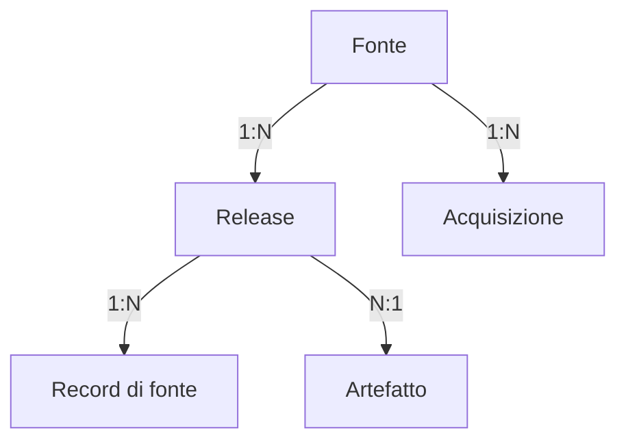
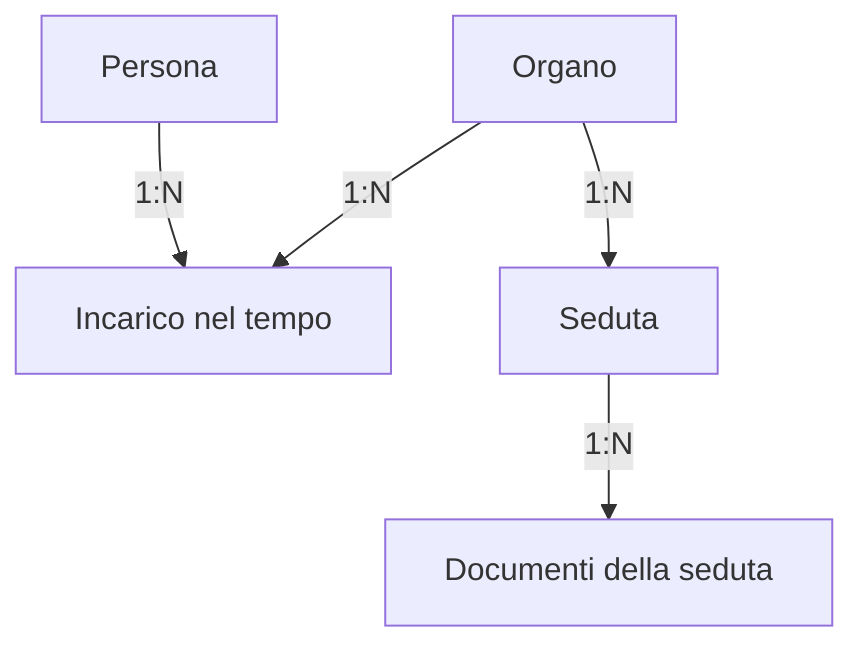
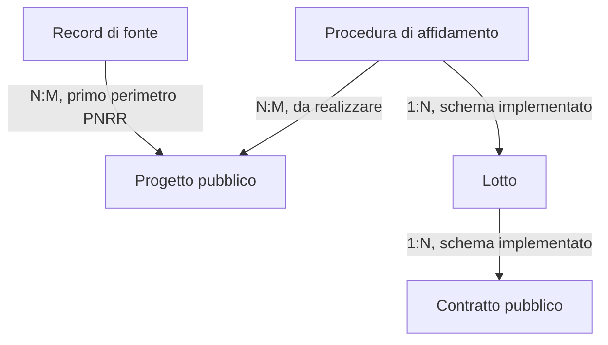

# Disegno concettuale del database

Revisione del 4 ottobre 2026 (#1651, #1653), dopo la [migrazione canonica PNRR](pnrr-canonical-model.md) e la [riconciliazione Albo](albo-canonical-model.md). Questo documento è il punto di ingresso corrente. Il [catalogo completo](conceptual-catalog.md) deriva dallo stesso registro usato dall’Archivio interno; la [verifica corrente](model-verification-2026-10-04.md) distingue definizioni, strutture, dati effettivi e lavoro residuo. L’assessment del 7 settembre rimane una rilevazione storica.

## I tre livelli

| Livello | Domanda | Fonte di verità |
| --- | --- | --- |
| Concettuale | Quale oggetto rappresentiamo e come lo distinguiamo dagli altri? | `conceptualCatalog` in `architecture/data-domain-registry.v1.json`, definizioni, identità e relazioni |
| Logico | Quale tabella conserva entità, record di fonte, associazione o proiezione? | Mappa delle 89 tabelle nel medesimo registro, con granularità esplicita |
| Fisico | Quali colonne, tipi, PK, FK, vincoli e indici esistono? | `lib/db/src/schema`, migrazioni versionate e catalogo PostgreSQL effettivo nell’Archivio interno |

Il profilo RDF 1.3.0 definisce una classe distinta per ciascuno dei 57 concetti civici censiti; contenuti redazionali e stato applicativo hanno esclusione esplicita. `model-mapping.json` collega le 89 tabelle ai concetti e conserva granularità e ruolo. Il collegamento è responsabilità concettuale: non afferma che tutte le righe legacy siano istanze RDF della classe o che tutti i record siano importati ed esportati. I domini del catalogo sono raggruppamenti, non nuovi schemi SQL.

## Identità e fonte

Una **fonte** pubblica informazioni; una **release** ne fissa una versione; un **record di fonte** è un’unità dentro quella versione. L’**artefatto** conserva i byte e la loro provenienza. Un tentativo di **acquisizione** può fallire o non produrre alcuna nuova release.

```mermaid
flowchart TD
  F["Fonte"] -->|"1:N"| R["Release"]
  F -->|"1:N"| A["Acquisizione"]
  R -->|"1:N"| S["Record di fonte"]
  R -->|"N:1"| B["Artefatto"]
```

Il registro `source_*` implementa questo nucleo per gli snapshot di repository previsti dal manifest. Non è ancora un importatore universale delle fonti esterne. Gli artefatti attuali sono identificati fisicamente da endpoint e hash; hash uguale non autorizza a cancellare la provenienza di un altro endpoint.

L’**identità canonica** è già predisposta in `canonical_subjects`, con `legacy_subject_map` per i riferimenti legacy. Non va introdotto un secondo registro parallelo chiamato `entities`. Il soggetto canonico è un riferimento stabile: le proprietà del progetto, della persona o dell’evento restano tipizzate nel dominio. Erano vuote nello snapshot del 7 settembre; la migrazione PNRR introduce il primo backfill verificato e ne rende visibile la copertura nell’Archivio interno.

Un record può descrivere più entità, non descriverne alcuna o restare irrisolto. Identificatori qualificati, fonte, metodo ed eventuale revisione devono sostenere il collegamento; somiglianza del titolo o del nome non è una regola di fusione.

## Atto, documento e pubblicazione

| Concetto | Identità | Rappresentazione attuale |
| --- | --- | --- |
| Atto | Autorità, ufficio, tipo, numero e data verificati | `document_acts`; `acts` rimane legacy e `fundamental_acts` è una selezione redazionale |
| Documento | Risorsa documentale distinta dall’atto e dai byte | `document_documents`; acquisizione e registro degli allegati binari ancora parziali |
| Pubblicazione | Registro qualificato e identificativo di pubblicazione | `document_publications`, con versioni immutabili in `document_publication_versions`; `publications` rimane compatibilità |

Una pubblicazione può riguardare più atti e uno stesso atto può essere ripubblicato. I collegamenti da una versione ad atti e risorse documentali sono persistiti con evidenza nelle tabelle `document_publication_acts` e `document_publication_documents`. Le relazioni tra atti e tutti gli allegati non sono universalmente riconciliate. PDF, testo estratto e scheda di pubblicazione non devono diventare tre atti canonici.

`lt:AdministrativeAct` conserva il significato del record amministrativo pubblicabile nelle API di compatibilità. `lt:AdministrativeDecision`, `lt:PublicationEvent` e `lt:DocumentResource` rappresentano le nuove identità distinte; le shape rifiutano la fusione delle tre classi. Gli IRI preesistenti non cambiano significato retroattivamente.

## Persone, organi e incarichi

```mermaid
flowchart TD
  P["Persona"] -->|"1:N"| I["Incarico nel tempo"]
  O["Organo"] -->|"1:N"| I
  O -->|"1:N"| S["Seduta"]
  S -->|"1:N"| D["Documenti della seduta"]
```

Il diagramma esprime le responsabilità concettuali; l’implementazione è parziale. `officials` incorpora attributi di ruolo; `organi_members` rappresenta l’appartenenza nel tempo. Occorre risolvere la persona e conservare più incarichi, intervalli e fonti, senza sovrascriverli con la sola carica corrente. Un organo e la persona che lo presiede hanno identità diverse. La seduta non coincide con il verbale o il singolo intervento.

## Progetti e contratti

```mermaid
flowchart TD
  R["Record di fonte"] -->|"N:M, primo perimetro PNRR"| P["Progetto pubblico"]
  A["Procedura di affidamento"] -->|"N:M, da realizzare"| P
  A -->|"1:N, schema implementato"| L["Lotto"]
  L -->|"1:N, schema implementato"| C["Contratto pubblico"]
```

`attuazione_pnrr_projects` e `italiadomani_projects` sono rappresentazioni per fonte del medesimo tipo di oggetto. La prima è identificata da `source_id`; la seconda dal CUP nel suo schema attuale. Il progetto canonico in `project_projects` usa un UUIDv7, identificatori qualificati in `project_identifiers` e scelte dei valori sostenute da asserzioni; mantiene versioni e divergenze di fonte. La mancanza di CUP non deve eliminare il record sorgente.

Procedura, lotto, aggiudicazione, contratto e pagamento hanno granularità diverse. Il CIG collega informazioni della procedura o del lotto, ma non identifica indistintamente ogni contratto, pagamento e menzione. `procurement_procedures`, `procurement_lots`, `procurement_contracts` e `procurement_financial_events` hanno identità, vincoli e evidenze distinti; il loro popolamento da fonti strutturate è ancora da riconciliare. I 41 candidati in `procurement_mentions` non generano contratti sintetici. `contracts` rimane una rappresentazione legacy; parti e attraversamento tra domini restano nel piano di migrazione.

## Misure, luoghi e contenuti civici

- **Indicatore → serie → osservazione**: la definizione della misura è distinta dalle dimensioni della serie e dal valore riferito a periodo e release. Il pattern demografico è già strutturato; la sua generalizzazione agli altri indicatori è da completare. Zero, sconosciuto e non applicabile devono restare distinti.
- **Luogo → rappresentazione geografica**: il luogo ha identità propria; geometria, fonte, sistema di riferimento, precisione e versione lo descrivono. I luoghi attestati di un evento non equivalgono a un territorio con rischio attribuito.
- **Segnalazione → monitoraggio**: la prima è un contributo ricevuto; la seconda è una scheda curata con verifiche. Nessuna segnalazione diventa automaticamente un fatto accertato.
- **Intervento → valutazione**: uno strumento di politica pubblica può avere più studi. La proposta civica locale è un ulteriore oggetto con autore, fonti e revisioni.
- **Classificazione**: temi civici, categorie editoriali e categorie di performance sono schemi diversi. Devono avere codici e corrispondenze esplicite, non una fusione basata sull’etichetta.
- **Eventi ed evidenze**: conservare i vincoli LTCEDS, gli stati probatori, la provenienza delle qualificazioni e la proiezione pubblica separata. Raggruppamenti e ricorrenze non attribuiscono responsabilità.

Le cardinalità nel catalogo sono massime; l’assenza di un collegamento resta consentita finché non esiste evidenza sufficiente. `implemented` riguarda la struttura di un dominio, non una copertura universale o la presenza di dati.

## Decisioni fisiche e passaggio graduale

L’aggiornamento PNRR aggiunge cinque tabelle con migrazioni `0021` e `0022`; l’aggiornamento Albo aggiunge identità qualificate e quattordici tabelle con `0023` e `0024`. Tutte e 25 le migrazioni versionate sono applicate in produzione al controllo del 4 ottobre. I tipi, gli indici e le FK restano ispezionabili; le 89 tabelle non sono sostituite da una tabella generica di attributi.

Per le successive migrazioni: aggiungere prima strutture tipizzate e ponti verso l’identità esistente; eseguire backfill idempotenti con record irrisolti espliciti; riconciliare conteggi e campi per fonte/versione; verificare le letture API; infine convertire i vecchi modelli in proiezioni di compatibilità. La dismissione richiede assenza di scritture legacy e nessuna perdita di evidenza. Non rinominare tabelle solo per farle assomigliare al menu.

PK e vincoli univoci devono esprimere l’identità alla granularità corretta; le FK devono collegare oggetti compatibili. Nuovi indici richiedono query e carichi misurati, senza dedurre prestazioni dalla sola presenza di una struttura. Gli importi esistenti usano tipi numerici e i metadati di acquisizione timestamp con fuso dove previsti dallo schema. La migrazione PNRR introduce gli indici associati ai nuovi vincoli e alle letture documentate. Non introduce PostGIS o nuovi servizi a pagamento.

## Manutenzione della mappa

Aggiornare il registro quando cambia una tabella, una rotta, un concetto o una fonte di lettura. Il controllo architetturale rifiuta tabelle e percorsi non classificati, classi primarie mancanti o fuse, relazioni senza mapping, evidenze di codice mancanti e proiezioni generate non aggiornate. Ontologia, shape, mapping, documentazione e sottogruppi del menu derivano dal registro; il catalogo fisico completo resta nell’area admin. Il validatore RDF prova anche rimozione di identità/provenienza, confusione tra classi, target sintetici e titoli trattenuti.

`pnpm run architecture:audit` verifica la convergenza strutturale. Non sostituisce la riconciliazione dei dati, la verifica della fonte o il controllo dell’autorizzazione server.
