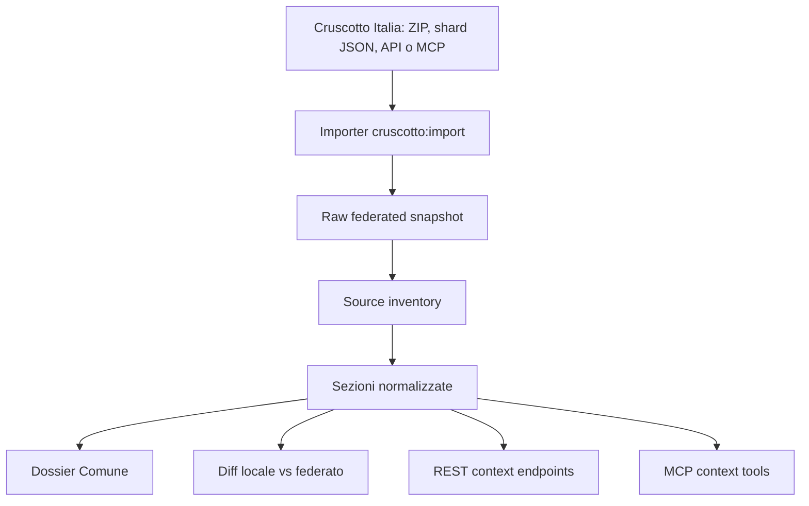

# Integrazione Cruscotto Italia

Issue di riferimento: #430

## Sintesi

Cruscotto Italia deve entrare in Lamezia Trasparente Monitor come **fonte federata nazionale**, non come semplice iframe, link esterno o replica non governata.

La funzione dell'integrazione è fornire contesto istituzionale ufficiale al monitor locale: contratti, PNRR, opere, SIOPE, demografia, scuole, sanità, RUNTS, imprese, sezioni censuarie, civici, beni culturali, patrimonio e altri domini vengono letti per codice ISTAT comunale e collegati alle sezioni già presenti nel prodotto.

Per Lamezia Terme il codice ISTAT operativo candidato è `079160`. Deve comunque essere verificato nella fase di audit tecnico prima della prima importazione automatica.

## Postura architetturale

### Non è fonte primaria universale

Cruscotto Italia aggrega e organizza fonti ufficiali nazionali e territoriali. Quando un dato arriva da Cruscotto Italia, la piattaforma deve mostrare sia:

- la **fonte primaria originaria**, per esempio ANAC, BDAP-MOP, SIOPE, ISTAT, MEF, RUNTS;
- la **fonte federatrice**, cioè Cruscotto Italia / AgID;
- la **trasformazione locale**, se Lamezia Trasparente normalizza, confronta, aggrega o collega quel dato.

### Non sostituisce le ingestion locali

Cruscotto Italia può evidenziare lacune o differenze, ma non deve cancellare o sovrascrivere dati già acquisiti localmente.

Regola pratica:

```txt
Dato locale + dato Cruscotto concordano     -> mostrare coerenza e fonte
Dato locale presente, Cruscotto assente     -> non cancellare; segnalare differenza
Dato Cruscotto presente, dato locale assente -> proporre integrazione o verifica
Dato locale e Cruscotto divergono           -> audit, non accusa
```

### Cache locale, non dipendenza live per page view

Per produzione l'integrazione deve preferire una cache locale read-only e verificabile:



Il MCP pubblico di Cruscotto Italia è utile per esplorazione, prototipazione e audit. La UI pubblica di Lamezia Trasparente non dovrebbe dipendere da chiamate live a servizi remoti per ogni caricamento pagina.

## Obiettivi di prodotto

### 1. Dossier Comune

Creare una vista “Dossier Comune” o “Contesto federato” con indicatori sintetici, non ridondanti rispetto alle sezioni locali.

KPI candidati:

- popolazione e demografia;
- redditi IRPEF e addizionale comunale;
- principali voci SIOPE;
- opere pubbliche BDAP-MOP;
- progetti PNRR;
- scuole e servizi educativi;
- farmacie, ospedali o presidi sanitari quando disponibili;
- RUNTS / Terzo Settore;
- imprese e addetti ASIA UL;
- civici ANNCSU e sezioni censuarie, se utili per atlante urbano;
- beni culturali e patrimonio pubblico;
- broadband / FTTH e servizi territoriali.

Ogni KPI deve avere fonte, data di aggiornamento, granularità e caveat.

### 2. Confronto locale vs federato

Per i domini già coperti da Lamezia Trasparente, Cruscotto Italia va usato come benchmark:

- contratti pubblici / ANAC;
- PNRR;
- opere pubbliche;
- indicatori territoriali;
- eventuali beni o patrimoni mappabili.

Formato minimo di confronto:

```ts
type FederatedDiff = {
  domain: "contracts" | "pnrr" | "works" | "performance" | "assets";
  localPresent: boolean;
  federatedPresent: boolean;
  localUpdatedAt?: string;
  federatedUpdatedAt?: string;
  primarySource?: string;
  federatedSource: "Cruscotto Italia";
  differenceKind: "none" | "missing-local" | "missing-federated" | "value-mismatch" | "date-mismatch" | "granularity-mismatch" | "unmatched";
  recommendedAction: "ok" | "verify" | "integrate" | "ignore-with-reason";
  note?: string;
};
```

La UI deve dire “differenza da verificare”, non “anomalia” o “irregolarità”.

### 3. API pubblica e MCP

Endpoint REST candidati:

```http
GET /api/public/v1/context/cruscotto-italia
GET /api/public/v1/context/cruscotto-italia/sources
GET /api/public/v1/context/cruscotto-italia/sections/{section}
GET /api/public/v1/context/cruscotto-italia/diff
```

Tool MCP candidati:

```txt
get_federated_context
get_cruscotto_section
compare_local_with_cruscotto
list_federated_sources
```

Regole:

- read-only;
- stesso data-access layer per REST e MCP;
- envelope coerente con la API pubblica;
- errori MCP con `isError: true` per entità mancanti;
- nessuna API key pubblica necessaria se si espongono solo dati già pubblicabili;
- nessun dato grezzo eccedente se non serve alla finalità civica.

### 4. Atlante urbano

Cruscotto Italia può accelerare l'audit di sezioni censuarie, variabili ISTAT, civici e geografie subcomunali. Tuttavia non deve sostituire una pipeline locale riproducibile per l'atlante.

Uso corretto:

- confronto identificativi;
- verifica disponibilità variabili;
- benchmark sulle geografie;
- source inventory;
- caveat su sezioni non residenziali, denominatori bassi, dati non rilevati o granularità mista.

Uso scorretto:

- mappare indicatori subcomunali senza denominatori;
- pubblicare “zone a rischio” senza metodologia;
- inferire condizioni sociali, illegalità o responsabilità da indicatori censuari;
- esporre dati puntuali non necessari.

## Modello dati minimo

```ts
type FederatedSource = {
  id: string;
  provider: "Cruscotto Italia";
  primarySource: string;
  section: string;
  licence?: string;
  updateFrequency?: string;
  extractedAt: string;
  sourceUpdatedAt?: string;
  granularity: "comunale" | "provinciale" | "regionale" | "subcomunale" | "puntuale" | "mista" | "unknown";
  publicUse: "published" | "audit-only" | "internal-only";
  caveat?: string;
};

type FederatedSnapshot = {
  comuneIstat: string;
  comuneName: string;
  importedAt: string;
  cruscottoVersion?: string;
  rawStorageKey?: string;
  sections: string[];
  sources: FederatedSource[];
};

type FederatedSectionSummary = {
  section: string;
  title: string;
  description?: string;
  metrics: Array<{
    key: string;
    label: string;
    value: string | number | null;
    unit?: string;
    sourceId: string;
    quality: "ok" | "partial" | "missing" | "stale" | "non_comunale" | "unverified";
    caveat?: string;
  }>;
};
```

## Mapping iniziale sezioni Cruscotto -> Lamezia Trasparente

| Sezione Cruscotto | Sezione Lamezia | Uso previsto | Priorità MVP |
| --- | --- | --- | --- |
| ANAC / contratti | Contratti pubblici | confronto e arricchimento fonte | alta |
| Italia Domani / ReGiS / PNRR | PNRR | confronto progetti, importi, stato | alta |
| BDAP-MOP | opere/interventi, monitoraggio civico | contesto opere e possibili schede civiche | alta |
| SIOPE | Dossier Comune, performance | contesto finanziario di cassa | media |
| ISTAT demografia | Dossier Comune | contesto territoriale | alta |
| MEF redditi | Dossier Comune | contesto socio-economico aggregato | media |
| RUNTS | Dossier Comune, terzo settore | contesto enti territoriali | media |
| ASIA UL | Dossier Comune | struttura produttiva aggregata | media |
| Sezioni censuarie | Atlante urbano | audit e geografie | media, con caveat |
| ANNCSU civici | Atlante urbano | geografie e controlli puntuali | bassa per v0 |
| Scuole / sanità / farmacie | Dossier Comune | servizi territoriali | media |
| Beni culturali / patrimonio | Dossier Comune, mappe | contesto territoriale | media |
| Catasto | audit puntuale | non layer pubblico iniziale | bassa |

## Fasi operative

### Fase 0 — Audit

- [ ] Verificare formato effettivo dei dati scaricabili o interrogabili.
- [ ] Verificare disponibilità per `079160`.
- [ ] Elencare sezioni presenti e assenti.
- [ ] Verificare licenze e attribuzione per ogni sezione.
- [ ] Distinguere dati comunali, sovracomunali, puntuali e derivati.
- [ ] Creare `source_inventory` o equivalente documentale.

### Fase 1 — Cache read-only

- [ ] Implementare importer dedicato, ad esempio `cruscotto:import`.
- [ ] Salvare snapshot grezzo versionato.
- [ ] Normalizzare solo sezioni MVP.
- [ ] Non sovrascrivere dati locali.
- [ ] Gestire assenza fonte come stato distinto da errore tecnico.

### Fase 2 — Dossier Comune

- [ ] Pubblicare almeno 6 KPI federati utili e non ridondanti.
- [ ] Mostrare sempre fonte primaria, fonte federatrice e data.
- [ ] Evidenziare granularità e caveat.
- [ ] Collegare ai domini già presenti quando utile.
- [ ] Evitare visualizzazioni fuorvianti su dati incompleti.

### Fase 3 — Diff locale/federato

- [ ] Implementare confronto ANAC/contratti.
- [ ] Implementare confronto PNRR.
- [ ] Valutare confronto opere pubbliche.
- [ ] Rendere esportabile o consultabile il report.
- [ ] Usare etichette caute: `ok`, `da verificare`, `da integrare`, `ignorato con motivazione`.

### Fase 4 — REST + MCP

- [ ] Aggiungere endpoint read-only.
- [ ] Aggiungere tool MCP read-only.
- [ ] Aggiornare documentazione pubblica.
- [ ] Aggiornare eventuale OpenAPI se la superficie REST entra nella API pubblica.
- [ ] Testare envelope, errori, paginazione e assenza dati.

### Fase 5 — Atlante e geografie

- [ ] Usare Cruscotto come benchmark per sezioni e variabili.
- [ ] Validare denominatori e sezioni non residenziali.
- [ ] Evitare indicatori sintetici sensibili senza metodologia.
- [ ] Documentare limiti e fonti in ogni vista geografica.

## Criteri di accettazione MVP

- [ ] Esiste un audit documentato per il comune di Lamezia Terme.
- [ ] Esiste una cache locale read-only dei dati federati scelti.
- [ ] Ogni sezione importata ha fonte primaria, fonte federatrice, licenza o nota di licenza, data di estrazione e granularità.
- [ ] Il Dossier Comune mostra almeno 6 KPI federati con caveat.
- [ ] Almeno un dominio locale è confrontato con Cruscotto Italia.
- [ ] REST e MCP espongono dati federati tramite lo stesso data-access layer.
- [ ] La documentazione pubblica chiarisce che Cruscotto Italia federa dati, non li rende automaticamente più veri dei dati primari.
- [ ] Nessuna differenza locale/federata è presentata come irregolarità.

## Red line specifiche

- Vietato iframe come unica integrazione.
- Vietato sostituire dati locali con dati federati senza audit.
- Vietato nascondere la fonte primaria dietro il brand Cruscotto Italia.
- Vietato generare score di rischio o legalità partendo dai soli dati federati.
- Vietato pubblicare dati puntuali eccedenti senza finalità civica e minimizzazione.
- Vietato trattare il MCP esterno come dipendenza runtime obbligatoria della UI pubblica.

## Domande aperte da chiudere prima del codice

- Qual è il formato più stabile per l'import: ZIP comunale, shard JSON, API o MCP?
- Cruscotto Italia espone una versione o data di aggiornamento globale utilizzabile negli snapshot?
- Quali sezioni hanno licenza esplicita e quali ereditano licenze dalla fonte primaria?
- Quali campi sono comunali e quali sono regionali/provinciali o derivati?
- Quali sezioni sono già coperte localmente con qualità superiore?
- Quali endpoint pubblici vanno introdotti subito e quali restano audit interno?

## Riferimenti

- Cruscotto Italia: `https://cruscotto-italia.dati.gov.it/about.html`
- Repository AgID: `https://github.com/AgID/cruscotto-italia`
- MCP Cruscotto Italia: `https://cruscotto-italia-mcp.agid.workers.dev/mcp`
- Documentazione API locale: `../../artifacts/api-server/PUBLIC_API.md`
