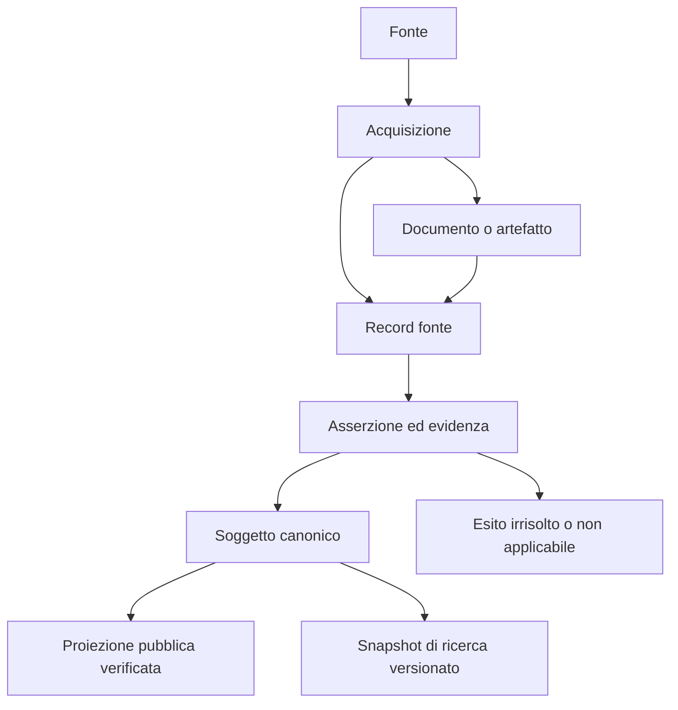
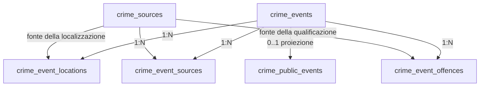

# Modello concettuale, logico e fisico

> Baseline storica dell’assessment iniziale (64 tabelle). Il punto di ingresso corrente è [Disegno concettuale del database](conceptual-schema.md); la [mappa generata](conceptual-catalog.md) comprende anche il registro snapshot aggiunto successivamente. I conteggi e gli stati sotto restano riferiti all’audit originario.

Companion dell'[assessment del 7 settembre 2026](database-assessment-2026-09-07.md). Estende il contratto architetturale v1; non sostituisce i domini già modellati. **«Esistente» indica strutture nel database; «target» indica strutture da implementare. Nessuna delle due etichette certifica il popolamento.**

## 1. Modello concettuale

L'unità originaria è un **record di una fonte**, acquisito in una determinata occasione e spesso sostenuto da un documento. Il record non coincide necessariamente con un atto, un contratto, un progetto o un evento: può descriverne più di uno oppure non consentire alcuna risoluzione. Un **soggetto canonico** identifica un'entità o un evento; le sue proprietà restano nei rispettivi domini tipizzati. Le **asserzioni** conservano ciò che ciascuna fonte sostiene, compresi divergenze e risultati di estrazione; la risoluzione determina quali valori usare, con metodo e motivazione espliciti.

Il seguente è il modello concettuale target della provenance; oggi esistono implementazioni parziali e specifiche per dominio.

Le classi principali sono:

| Classe | Significato e invariante |
|---|---|
| Fonte / endpoint | Chi pubblica e dove si acquisisce; una fonte può avere più endpoint e dataset |
| Acquisizione / release | Il tentativo di acquisizione e la versione informativa acquisita sono distinti; fallimenti e copertura restano registrati |
| Artefatto | Oggetto fisico identificato da hash, formato e locator; i byte possono stare fuori PostgreSQL |
| Record fonte | Unità osservata presso la fonte, con chiave originaria e versione; non viene scartata perché manca un CIG/CUP o un'identità canonica |
| Soggetto canonico | Identità stabile di un'entità o evento; UUIDv7 per i nuovi soggetti; non è un contenitore generico di attributi |
| Identificatore | Valore, schema identificativo, autorità emittente e validità; CIG, CUP e codici ISTAT non sono intercambiabili |
| Asserzione / risoluzione | Valore sostenuto da una fonte, estratto, derivato o curato; evidenza, metodo e storia conservati |
| Persona / organizzazione / ruolo | Identità separata dalla carica, dal mandato e dalla partecipazione a un evento |
| Evento amministrativo | Adozione, affidamento, liquidazione, variante, seduta o altro evento tipizzato; un evento non coincide con ogni documento che lo menziona |
| Luogo / geometria | Localizzazione attestata, risolta e pubblicabile distinte; precisione e sensibilità esplicite |
| Serie / osservazione | Indicatore, unità, dimensioni, periodo, release e stato del valore; uno zero osservato è diverso da dato mancante |
| Proiezione pubblica | Risultato della policy di pubblicazione, con versione e data; non una lettura indistinta delle tabelle interne |

Per gli eventi criminali restano vincolanti LTCEDS, stato probatorio, ruolo del luogo, geoprivacy e separazione tra dati canonici e pubblici. Nessuna relazione o aggregazione attribuisce responsabilità o misura automaticamente il rischio criminale.

## 2. Modello logico esistente

Le 64 tabelle sono già classificate nel registro dei domini. La tabella seguente è la mappa dei principali contesti; l'inventario allegato assegna ogni singola tabella senza omissioni.

| Contesto | Tabelle principali esistenti | Relazioni e limite attuale |
|---|---|---|
| Identità comune | `canonical_subjects`, `legacy_subject_map` | Mappa legacy → soggetto; la FK è presente, ma entrambe le tabelle sono vuote |
| Documenti e atti | `publications`, `acts`, `fundamental_acts`, `oversight_opinions`, `oversight_opinion_documents` | Link tipizzati ai documenti in alcuni percorsi; pubblicazione, documento e atto non sono ancora risolti universalmente |
| Appalti | `contracts` | Riga monolitica e collegamento editoriale a `themes`; manca il modello universale procedura/lotto/contratto/eventi/parti |
| Progetti | `attuazione_pnrr_projects`, `italiadomani_projects` | Rappresentazioni specifiche per fonte; manca la riconciliazione persistente unica per progetto |
| Fonti open data | `opendata_datasets`, `opendata_resources`, `opendata_snapshots` | Dataset 1:N risorse 1:N snapshot; schema utile, non popolato nel database esaminato |
| Operazioni | `feed_status`, `change_sentinel_events` | Stato e coda di cambiamenti; non sostituiscono ancora un registro universale dei run |
| Statistiche | `demographic_series`, `demographic_releases`, `demographic_observations`, tabelle `performance_*` | Modello serie/release/osservazioni presente nella demografia; metadati di fonte da generalizzare |
| Istituzioni | `officials`, `official_*`, `organi`, `organi_members`, `sedute`, `session_reports`, `session_interventions` | FK e storia delle appartenenze parzialmente presenti; identità della persona ancora da separare dal ruolo |
| Beni | `confiscated_assets` | Bene, stato e localizzazione concentrati nella riga; lifecycle e provenance da strutturare |
| Eventi criminali | `crime_events`, `crime_sources`, `crime_event_sources`, `crime_event_offences`, `crime_event_locations`, tre tabelle dei cluster, `crime_public_events` | Eventi e fonti N:M; eventi 1:N qualificazioni e luoghi; proiezione pubblica separata |
| Bandi e monitoraggio | `bandi`, `bando_matches`, `accesso_civico_requests`, `monitoring_reports`, `reports`, `legality_*` | Processi tipizzati; alcuni collegamenti polimorfici con FK alternative e link JSON |
| Redazione e applicazione | `categories`, `themes`, `theme_*`, `questions`, `page_blocks`, `site_strings`, `helper_overrides`, `shares`, `conversations`, `messages` | Stato editoriale e applicativo, da non confondere automaticamente con eventi civici canonici |

Esempio di relazioni **già presenti**, direttamente verificabili nelle FK del dizionario:

La presenza delle FK non dimostra la correttezza sostanziale dell'associazione: quella dipende dall'evidenza e dai controlli di dominio. Le cardinalità complete, le azioni ON DELETE/ON UPDATE e i vincoli sono nel dizionario fisico, non dedotti dalle frecce.

## 3. Modello logico target e normalizzazione

| Namespace target | Responsabilità | Stato al momento dell'audit |
|---|---|---|
| `source` | Fonti, endpoint, acquisizioni, release, artefatti e record | Fasi 3–4 pianificate; esistono precursori per dominio |
| `core` | Identità dei soggetti, asserzioni, risoluzioni e relazioni trasversali | Solo fondazione di identità implementata, fisicamente in `public` |
| `taxonomy` | Schemi, concetti, classificazioni e crosswalk versionati | Pianificato; tassonomie presenti anche nei file |
| `document`, `administrative` | Documenti, pubblicazioni, atti, procedimenti ed eventi | Tabelle legacy e transizione da riconciliare |
| `party`, `institution` | Persone, organizzazioni, ruoli, mandati, organi e sedute | Transizione pianificata |
| `procurement`, `project` | Procedure, lotti, contratti, eventi finanziari e progetti | Modelli tipizzati target da completare |
| `geo`, `asset` | Luoghi, geometrie, asserzioni geografiche, beni e lifecycle | Pianificati; PostGIS non installato né necessario per le sole letture attuali |
| `statistics` | Serie, release, osservazioni e dimensioni | Pattern demografico da generalizzare e popolare |
| `crime` | Modello LTCEDS | Pattern implementato; mantenere i suoi vincoli specifici |
| `editorial` | Redazione, configurazioni e override | Contesto da conservare distinto dai fatti civici |
| Proiezioni pubbliche / `research` | Read model pubblici e snapshot riproducibili | Pattern LTCEDS presente; adozione universale pianificata |

Regole progettuali:

- Usare colonne e relazioni tipizzate per identità, importi, date, ruoli e relazioni interrogate. Conservare JSONB per payload fonte, estrazioni, attestazioni e proiezioni versionate, con validazione. Non imporre che ogni JSON venga frammentato, né usarlo per evitare FK e vincoli necessari.
- Modellare le relazioni N:M con tabelle associative; evitare nuovi fasci di FK opzionali come soluzione universale ai riferimenti tra domini. Conservare le FK tipizzate dove sono più forti e precise.
- Distinguere data dell'evento/validità, data di pubblicazione della fonte, data di acquisizione e data di registrazione/correzione. Una correzione non deve cancellare la versione precedente.
- Conservare gli esiti `unknown`, `unresolved`, `not_applicable`, `insufficient_evidence` e `review_required` quando applicabili. Una stringa vuota o un timestamp artificiale non risolvono una mancanza informativa.
- Usare unicità su identificatori validati e composizioni di chiavi appropriate; non forzare la deduplica su nomi di persone/aziende o titoli di documenti.
- Collegare ogni proiezione al cutoff delle fonti, alle versioni del modello/tassonomia e alla policy di pubblicazione. Le esclusioni devono avere un motivo misurabile.

## 4. Disegno fisico e accesso

Lo schema fisico osservato è descritto integralmente in [database-dictionary.md](audits/2026-09-07/database-dictionary.md) e [database-audit.json](audits/2026-09-07/database-audit.json). `public` è oggi il nome dello schema PostgreSQL predefinito: **non significa che i suoi record siano pubblicabili**. L'API deve continuare a distinguere superfici pubbliche, redazione, ingestione e consultazione riservata.

La nuova console legge il catalogo del database in uso dall'API e confronta tabelle/colonne con gli export Drizzle. I valori delle richieste sono parametri SQL; tabelle e colonne vengono validate. Ogni lettura avviene in una transazione `REPEATABLE READ READ ONLY`; timeout per query 3 secondi, per lock 500 ms, due richieste concorrenti per processo. Nessun endpoint esegue SQL fornito dall'utente o mutazioni.

Le liste hanno al massimo 100 record per pagina; l'interfaccia ne usa 50 e limita la navigazione a 1.000 pagine prima di richiedere un filtro più selettivo. Le anteprime delle celle hanno limite 2.048 caratteri; il dettaglio 65.536, con troncamento dichiarato. Questi limiti proteggono la consultazione da payload molto grandi; un export integrale di ricerca è una capacità distinta da implementare con il suo contratto.

## 5. Accettazione della convergenza dei dati

Per ciascun flusso la riconciliazione deve produrre insiemi di identificatori, non soltanto totali: osservati → acquisiti → interpretabili → risolti/irrisolti → registrati → pubblicabili/pubblicati. Devono essere spiegate tutte le differenze rispetto all'universo dichiarato e al periodo scelto. La somma delle categorie è un controllo valido soltanto quando quelle categorie sono definite come disgiunte.

La chiusura di un dominio richiede almeno: hash/documenti fonte conservati; importazione ripetibile senza duplicati; gestione delle revisioni; mappatura dei campi e dei valori mancanti; confronto record per record sui campi critici; controlli sui collegamenti; campione manuale di riferimento; equivalenza della proiezione pubblica; rollback definito. Solo allora si può spostare la responsabilità semantica dal percorso legacy al database canonico.
