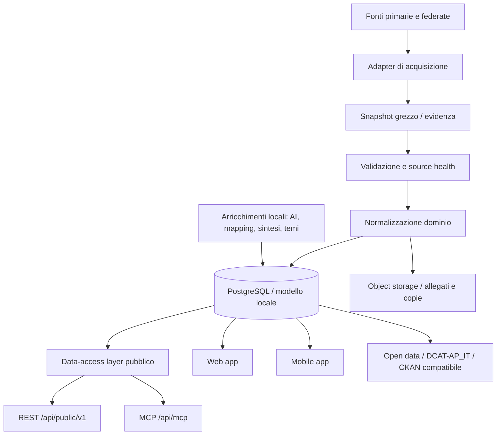

# Architettura delle integrazioni

## Scopo

Questo documento definisce l'architettura logica delle integrazioni che alimentano Lamezia Trasparente Monitor.

L'obiettivo non è descrivere ogni dettaglio di implementazione, ma fissare il contratto architetturale che ogni nuova fonte deve rispettare per entrare nel sistema senza degradare tracciabilità, riuso, qualità informativa, accessibilità e prudenza civica.

## Vista d'insieme



La regola centrale è che la piattaforma non espone direttamente scraper, parser o fonti remote nelle pagine pubbliche. Ogni dato deve passare almeno da acquisizione, normalizzazione, conservazione della provenienza e controllo dei limiti.

## Livelli dell'architettura

### 1. Fonte

Una fonte può essere:

- **primaria locale**, quando il dato nasce da un portale del Comune o da un atto ufficiale comunale;
- **primaria nazionale**, quando il dato nasce da un'amministrazione o piattaforma nazionale, ad esempio ANAC, ANBSC, ISTAT o Italia Domani;
- **federata**, quando una piattaforma aggrega fonti primarie altrui, come Cruscotto Italia;
- **editoriale**, quando il dato è prodotto da Lamezia Trasparente Monitor, ad esempio temi civici, note, collegamenti e classificazioni;
- **strumentale**, quando serve al funzionamento del servizio ma non costituisce fonte documentale, ad esempio email, storage, geocoding o AI.

Per ogni fonte deve esistere una scheda minima con:

```ts
type SourceDescriptor = {
  id: string;
  name: string;
  role: "primary-local" | "primary-national" | "federated" | "editorial" | "service";
  owner?: string;
  homepage?: string;
  licence?: string;
  updateFrequency?: string;
  expectedGranularity?: "atto" | "contratto" | "progetto" | "dataset" | "comunale" | "subcomunale" | "puntuale" | "mista";
  publicUse: "publish" | "audit-only" | "internal-only";
  caveat?: string;
};
```

### 2. Adapter di acquisizione

L'adapter è responsabile solo di acquisire e trasformare il dato nella forma minima necessaria. Non deve incorporare logiche editoriali, accuse, score o classificazioni opache.

Ogni adapter deve produrre evidenze tecniche:

- URL o identificativo della fonte;
- data e ora di estrazione;
- eventuale data di pubblicazione dichiarata dalla fonte;
- hash o identificatore stabile del payload, quando possibile;
- stato dell'acquisizione;
- errori osservabili;
- versione dello schema locale usato per la normalizzazione.

### 3. Snapshot grezzo

Quando tecnicamente e legalmente possibile, il sistema deve conservare uno snapshot grezzo o una copia archiviata del documento/payload usato per generare il dato locale.

Lo snapshot non implica pubblicazione integrale: può restare evidenza interna se contiene dati eccedenti, metadati non necessari o formati non idonei. La pubblicazione deve seguire minimizzazione, licenza e finalità civica.

### 4. Validazione e source health

Ogni fonte deve avere controlli proporzionati:

- raggiungibilità della fonte;
- forma del payload;
- presenza di campi obbligatori;
- duplicati;
- regressioni improvvise di volume;
- dati assenti ma fonte raggiungibile;
- dati assenti perché fonte non raggiungibile;
- differenza tra errore tecnico e assenza informativa.

Il sistema deve preferire errori espliciti e monitorabili a fallback silenziosi.

### 5. Normalizzazione dominio

La normalizzazione trasforma fonti eterogenee in domini civici comprensibili: atti, contratti, PNRR, performance, bandi, beni confiscati, dataset open data, segnalazioni civiche, contesto territoriale.

La normalizzazione non deve eliminare il riferimento alla fonte. Ogni entità pubblicabile deve poter rispondere almeno a queste domande:

- da dove viene questo dato?
- quando è stato estratto?
- chi lo ha prodotto originariamente?
- la piattaforma lo ha solo copiato, normalizzato, arricchito o interpretato?
- quanto è granulare?
- quali limiti deve conoscere l'utente?

### 6. Data-access layer pubblico

Le superfici pubbliche REST e MCP devono leggere dallo stesso data-access layer quando espongono gli stessi dati. Questa regola è già applicata nella documentazione del server pubblico: REST è montata su `/api/public/v1`, MCP su `/api/mcp`, ma entrambe condividono la stessa logica dati quando il dominio coincide.

Per ogni nuovo dominio pubblico serve decidere se entra in:

- UI web/mobile;
- API REST;
- MCP;
- Open data;
- solo audit interno;
- nessuna pubblicazione, ma uso come benchmark.

## Contratto minimo di integrazione

Ogni nuova integrazione deve includere almeno:

| Area | Requisito minimo |
| --- | --- |
| Fonte | scheda fonte con ruolo, owner, licenza, granularità e caveat |
| Acquisizione | adapter idempotente, errori osservabili, nessuna scrittura distruttiva implicita |
| Provenienza | URL/ID fonte, data estrazione, data pubblicazione se disponibile |
| Conservazione | snapshot o riferimento stabile al payload, quando possibile |
| Qualità | validazione campi obbligatori, duplicati, stato assenza dati |
| Pubblicazione | distinzione tra dato ufficiale, dato normalizzato e dato editoriale |
| API | endpoint versionati o inseriti in superficie versionata; envelope coerente |
| MCP | tool read-only, coerente con REST dove il dominio coincide |
| UI | badge fonte, data aggiornamento, caveat e linguaggio non accusatorio |
| Open data | metadati, licenza, formati aperti, tracciabilità dataset/risorsa |
| Operatività | test o checklist, piano di fallback, source health |

## Ciclo di vita di una fonte

### 1. Candidatura

Prima di scrivere codice, aprire una issue o aggiornare una issue esistente con:

- utilità civica;
- fonte e titolare;
- licenza;
- disponibilità tecnica;
- granularità;
- rischio privacy;
- rischio di interpretazione errata;
- dominio di prodotto interessato;
- criteri di accettazione.

### 2. Prototipo controllato

Il prototipo può usare campioni statici o strumenti esterni, ma non deve entrare nella UI pubblica come dato live senza controlli.

### 3. Importer/cache

L'importer deve produrre dati riproducibili, non dipendere da stato implicito e non sovrascrivere dati locali con dati federati senza una decisione esplicita.

### 4. Esposizione pubblica

La pubblicazione richiede:

- fonte visibile;
- caveat visibile;
- stato di aggiornamento;
- linguaggio prudente;
- fallback per fonte non aggiornata;
- nessuna pretesa di completezza salvo prova documentata.

### 5. Manutenzione

Ogni fonte pubblica deve avere una responsabilità di manutenzione: source health, note di rottura, deprecazione, sostituzione o congelamento dello snapshot.

## Classificazione delle trasformazioni

| Trasformazione | Esempio | Come va dichiarata |
| --- | --- | --- |
| Copia | allegato PDF archiviato | copia tecnica della fonte ufficiale |
| Parsing | testo estratto da PDF | estrazione best-effort, con limiti |
| Normalizzazione | importi, date, categorie | trasformazione locale da dato ufficiale |
| Collegamento | contratto collegato a tema o PNRR | relazione locale, non affermazione della fonte primaria |
| Sintesi AI | riassunto di un atto | ausilio redazionale automatico, non testo ufficiale |
| Aggregazione | KPI per sezione | indicatore derivato, con formula e fonte |
| Confronto | locale vs federato | audit di coerenza, non accusa |

## Allineamento con prassi AgID/Developers Italia

Le integrazioni devono essere progettate per essere comprensibili, riusabili e manutenibili, in coerenza con le linee guida su acquisizione e riuso software, con la pubblicazione open source e con la manutenzione del software aperto.

In pratica, per questa repository significa:

- documentare le decisioni architetturali nella repository, non solo nelle issue;
- usare contratti espliciti, versionati e leggibili da macchine quando una superficie è pubblica;
- mantenere codice, documentazione, issue e PR tracciabili;
- evitare segreti o configurazioni non documentate;
- favorire formati aperti, API documentate e metadati di fonte;
- progettare interfacce e contenuti accessibili, comprensibili e non fuorvianti;
- prevedere manutenzione, deprecazione e fallback.

## Red line editoriali e legali

Le integrazioni servono a rendere più leggibile la trasparenza amministrativa. Non devono trasformare automaticamente dati incompleti, ritardi, differenze di fonte o anomalie tecniche in sospetti di illecito.

Sono vietati senza metodologia separata:

- score automatici di legalità o illegalità;
- ranking di rischio reputazionale;
- claim di corruzione, favoritismo, infiltrazione, frode o danno erariale;
- inferenze personali su funzionari, imprese o cittadini;
- esposizione di dati personali non necessari;
- pubblicazione di dati federati senza fonte primaria e caveat.

## Checklist per una nuova integrazione

- [ ] La fonte è descritta nel catalogo fonti.
- [ ] Licenza e condizioni d'uso sono state verificate.
- [ ] Granularità e frequenza di aggiornamento sono dichiarate.
- [ ] È chiaro se la fonte è primaria, federata, editoriale o strumentale.
- [ ] È definito se il dato entra in UI, REST, MCP, open data o solo audit.
- [ ] È definito il fallback in caso di fonte non raggiungibile.
- [ ] Gli eventuali dati personali sono minimizzati.
- [ ] Il copy pubblico è prudente e non accusatorio.
- [ ] I dati federati non sovrascrivono dati locali senza revisione.
- [ ] Sono previsti test, source health o almeno una checklist manuale.
