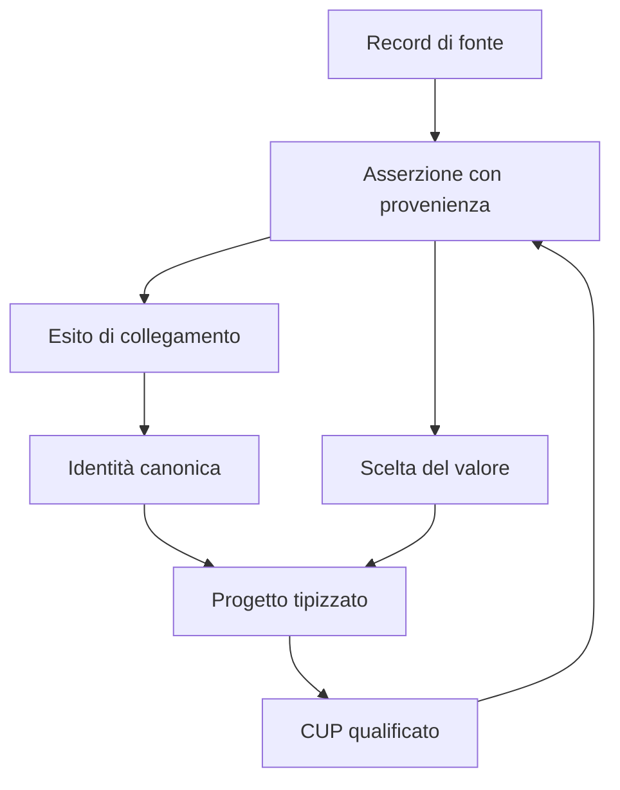

# Progetti PNRR: modello, provenienza e migrazione

Revisione 8 settembre 2026 — #1118. Primo dominio operativo sul nucleo di
identità ed evidenze delle fasi 2, 3 e 5. Il perimetro verificato è lo snapshot
PNRR comunale già registrato, che include schede OpenCUP ed evidenze pubbliche
dell’Albo. Non rappresenta un censimento completo di tutte le fonti PNRR.

## Disegno concettuale

Un progetto ha una sola identità interna indipendente dalle fonti. CUP, scheda
comunale, scheda OpenCUP e menzione nell’Albo svolgono ruoli diversi.

Gli esiti possono rimanere irrisolti: non richiedono la creazione di un progetto.
Una menzione nell’Albo può riferire più CUP e riceve un esito per ciascun
candidato. Un arricchimento OpenCUP con CUP diverso da quello della scheda
comunale è conservato per revisione, senza attribuirne i valori al progetto.

## Modello logico e fisico

| Tabella | Granularità e responsabilità |
| --- | --- |
| `canonical_subjects` | Identità UUIDv7, con tipo `entity` e dominio `project.project` |
| `project_projects` | Un progetto con campi tipizzati; importi `numeric(14,2)`, date civiche `date` |
| `project_identifiers` | Codice qualificato da schema `CUP`, emittente `it.dipe`, valore e asserzione di supporto |
| `core_assertions` | Un contenuto estratto da record/versione/puntatore, con valore, stato epistemico, hash e fonte |
| `core_resolution_outcomes` | Esito immutabile per record/candidato/versione del risolutore; target facoltativo |
| `project_field_resolutions` | Scelta del valore di un campo, evidenza selezionata, numero di alternative e intervallo di validità |
| `legacy_subject_map` | Ponte con gli ID locali delle schede Attuazione; una sola associazione attiva per ID |

Le asserzioni conservano evidenze, non sostituiscono le proprietà tipizzate del
progetto con un archivio EAV. Ogni collegamento rinvia al record, alla release e
ai byte già conservati in `source_*`. Nessun secondo registro universale
`entities` viene introdotto. Il registro concettuale classifica tutte le 75
tabelle e genera la documentazione e la navigazione dell’Archivio interno.

Le migrazioni additive `0021` e `0022` introducono cinque tabelle e indici per
identificatori, FK e consultazione della storia. Vincoli impediscono target
fittizi negli esiti irrisolti, associazioni incrociate fra asserzione e record,
più scelte attive dello stesso campo e più progetti per lo stesso CUP qualificato.

## Regole di interpretazione

- Il controllo CUP normalizza maiuscole e spazi esterni e verifica 15 caratteri
  alfanumerici. La qualifica è `source_reported_format_checked`: non certifica
  validità presso DIPE. Titoli simili non sono una regola di fusione.
- Le descrizioni comunali hanno precedenza per il titolo pubblico. Il titolo
  OpenCUP resta un’asserzione distinta. Le varianti sono conteggiate, senza
  presentarle automaticamente come errori.
- Importo finanziato comunale, costo totale OpenCUP e finanziamento pubblico
  OpenCUP sono misure separate. Stato di avanzamento e stato del CUP sono
  cicli differenti. Titolare del programma e soggetto registrato in OpenCUP
  non sono automaticamente lo stesso ruolo.
- Zero è un valore conosciuto; `null` resta sconosciuto. Importi con precisione
  non supportata e date incomplete/invalide non sono arrotondati o completati.
- Gli allegati e i contenuti OpenCUP non proiettati nei campi principali restano
  nei record e nelle asserzioni. Le classificazioni derivate mantengono tale
  natura; non vengono attribuite alla fonte come qualificazioni ufficiali.

## Processo e compatibilità

L’avvio già autorizzato tramite `SOURCE_SNAPSHOT_SYNC_ON_START` registra e verifica
prima gli snapshot. Solo dopo il successo riconcilia i progetti, in una
transazione con lock consultivo, timeout e prove prima del commit.

La ripetizione riusa identità, asserzioni, esiti e scelte invariate. Un nuovo
record/versione aggiunge evidenze; una nuova scelta chiude l’intervallo precedente
e ne apre uno nuovo. Cambiare la destinazione di un ID legacy esistente richiede
una decisione esplicita: l’importazione automatica fallisce e annulla la propria
transazione. Modifiche non spiegate ai valori canonici o decisioni manuali non
vengono sovrascritte.

Una riga della tabella di compatibilità può essere aggiornata solo se tutti i
valori correnti corrispondono alla precedente versione di fonte acquisita con
successo. In caso contrario resta il blocco per conflitto. I byte e i record
precedenti rimangono disponibili.

REST pubblico e MCP mantengono gli ID numerici e la forma precedente. Filtri,
ordinamento e valori usano le stesse espressioni SQL. Il ponte usa la proiezione
canonica solo quando CUP e contenuti coincidono con la riga di compatibilità;
in caso di mancata riconciliazione restituisce la riga precedente intera. Non
mescola un CUP nuovo con valori del vecchio progetto e non perde righe senza CUP.
L’Archivio interno espone separatamente la divergenza.

Il fallback statico rimane un export versionato della stessa fonte. La prova di
parità segue la catena byte dello snapshot → record registrati → riga di
compatibilità → campi canonici. L’acquisizione di nuove fonti e la dismissione
degli importatori legacy restano fasi distinte; non si effettua alcun drop o
freeze in questa migrazione. Per tornare alle letture precedenti è sufficiente
ridistribuire il commit precedente, conservando le nuove tabelle e le evidenze.

## Verifica del perimetro iniziale

Prova su una copia isolata del PostgreSQL di produzione, con hash dello snapshot
`78de948bd85ae3cc60a18d876057605840a152a48f6a1cb551dd83f440d2a629`.

| Misura | Risultato |
| --- | ---: |
| Record di fonte | 41: 30 schede e 11 evidenze Albo |
| Progetti canonici / associazioni legacy | 30 / 30 |
| Asserzioni di fonte | 1.331 |
| Candidati con esito risolto | 71 |
| Candidati irrisolti / record non processati | 0 / 0 |
| Scelte attive dei campi | 510 |
| Campi con varianti di descrizione | 30 |
| Differenze con valori selezionati e righe precedenti | 0 |

La seconda esecuzione con nuovi ID candidati non incrementa alcun conteggio e
mantiene invariata l’impronta delle identità. Le prove di modifica manuale,
cambio non autorizzato del ponte e aggiornamento gestito sono state eseguite in
transazioni annullate: i conflitti bloccano la scrittura e i dati iniziali restano
identici. Le verifiche di produzione successive al merge devono essere registrate
separatamente, senza confonderle con questi risultati di prova.

La query pubblica compilata da Drizzle è stata eseguita sul database di prova:
30 righe, nessuna differenza sull'intera riga rispetto alla compatibilità.
Anche un cambio di CUP temporaneo mantiene la riga pubblica coerente; la prova
è annullata senza conservare dati di test.

Validazioni locali: build completa del monorepo con typecheck, 17 test delle
fonti e del piano PNRR, 18 test API di autorizzazione/avvio/bundle, 8 test
dell'Archivio interno, controllo migrazioni non distruttive, inventario
architetturale e smoke del fallback statico. Quest'ultimo esegue l'artefatto
generato senza riscriverlo; non sostituisce la successiva verifica pubblica.

La data dello snapshot delle fonti è il 3 settembre 2026. Una verifica positiva
dell’importazione non equivale a un nuovo aggiornamento delle fonti. Italia
Domani è ancora priva di record nel database osservato; non viene inventata una
copertura. Le altre migrazioni di dominio, gli adattatori di acquisizione e gli
export RDF restano esplicitamente nel piano generale.
