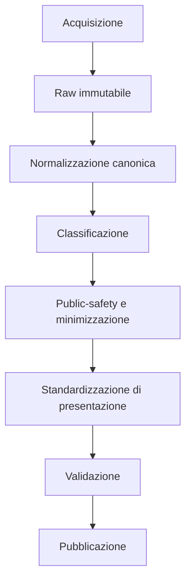

# Layer di standardizzazione prima della pubblicazione

## Decisione

Ogni pipeline che pubblica dati deve attraversare un confine esplicito tra il
dato acquisito e la sua forma di presentazione. Il dato ufficiale non viene
riscritto: resta nel livello raw o canonico secondo le regole di accesso e
privacy; il layer aggiunge una proiezione leggibile, versionata e verificabile.

Il layer non e' un correttore generico eseguito nel frontend. Fa parte della
pipeline dati e precede la scrittura dell'artefatto o del record pubblico.



## Due responsabilita' distinte

| Operazione                         | Momento                      | Scopo                                                                   | Puo' cambiare il significato?                    |
| ---------------------------------- | ---------------------------- | ----------------------------------------------------------------------- | ------------------------------------------------ |
| Normalizzazione canonica           | dopo parsing/acquisizione    | uniformare tipi, date, importi, identificativi e valori tecnici         | no                                               |
| Standardizzazione di presentazione | dopo il public-safety gate   | produrre titoli e testo di ricerca leggibili dal solo dato pubblicabile | no                                               |
| Classificazione                    | prima della presentazione    | associare tassonomie e categorie versionate                             | no; aggiunge un'etichetta locale                 |
| Sintesi o interpretazione          | processo editoriale separato | spiegare il contenuto                                                   | potenzialmente si; non appartiene a questo layer |

Questa separazione evita tre errori: sovrascrivere la fonte, confondere una
classificazione con un dato ufficiale e reintrodurre nella presentazione
informazioni rimosse per privacy.

## Invarianti

1. **La fonte resta intatta.** Il titolo ufficiale rimane nel livello raw o
   canonico; `display_title` e' un campo aggiuntivo. Se il titolo non e'
   pubblicabile, il layer riceve soltanto la sua proiezione minimizzata.
2. **Prima la sicurezza.** Il layer di presentazione riceve solo campi gia'
   ammessi o minimizzati per la pubblicazione.
3. **Solo regole deterministiche.** Nessun modello generativo riscrive i titoli.
4. **Ogni profilo e' versionato.** Una modifica delle regole cambia la versione,
   non il dato ufficiale.
5. **Ogni trasformazione e' visibile.** Il record elenca le regole applicate e
   gli eventuali motivi di revisione.
6. **Nessun troncamento distruttivo.** I titoli lunghi restano completi e sono
   marcati con `layout_flags`, senza trasformare automaticamente la lunghezza
   in una richiesta di revisione semantica.
7. **I diff amministrativi restano puliti.** Un cambio di sola presentazione non
   viene segnalato come modifica dell'atto alla fonte.
8. **Le regole di sicurezza sono retroattive sul layer pubblico.** Prima del
   confronto, la baseline pubblica attraversa nuovamente la policy corrente;
   un valore oggi escluso non puo' riapparire nel lato `before` o `removed` del
   diff.
9. **La revoca documentale e' effettiva.** Se un record corrente non e' piu'
   eleggibile per privacy, il manifest rimuove URL e percorso e la copia PDF
   pubblica viene eliminata con controllo stretto del path.
10. **Il serving e' fail-closed.** Sviluppo e build espongono solo i PDF validi
    autorizzati dal manifest corrente o da una piccola allow-list storica
    revisionata, verificandone anche il digest fisico; la sola presenza di un
    file nell'archivio non ne autorizza la pubblicazione.
11. **I derivati non necessari restano fuori.** Le proiezioni minimizzate non
    pubblicano l'hash calcolato sul record grezzo.
12. **La minimizzazione copre tutti i campi testuali liberi.** Nei record
    limitati anche `office` e `act_type` sono rimossi: la protezione non si
    concentra sul solo oggetto.
13. **Le baseline sono riproiettate per allow-list.** I record pubblici
    persistiti non vengono inoltrati con uno spread aperto; soltanto i campi
    previsti dal contratto possono raggiungere diff e pubblicazione.

## Contratto pubblico v1

Il campo ricevuto dal layer continua a vivere senza modifiche nel record
pubblico; puo' coincidere con il valore ufficiale oppure con una proiezione
minimizzata. La presentazione usa questo contratto aggiuntivo:

```ts
type PublicationPresentation = {
  display_title: string;
  action_id: string | null;
  action_label: string | null;
  search_text: string;
  area_theme?: {
    schema_version: "publication-area-theme.v1";
    taxonomy_id: string;
    taxonomy_version: string;
    theme_id: string | null;
    theme_label: string | null;
    confidence: "high" | "medium" | null;
    basis: "deterministic_rule" | "manual_override" | "fallback";
    rule_id: string | null;
    evidence: Array<{
      rule_id: string;
      input_field: string;
      matched_terms: string[];
    }>;
    null_reason:
      | "input_withheld_for_privacy"
      | "input_missing"
      | "not_classified"
      | "ambiguous_match"
      | null;
    override: {
      id: string;
      theme_id: string;
      confidence: "high" | "medium";
      rationale: string;
      previous_theme_id: string | null;
      previous_rule_id: string | null;
    } | null;
  };
  standardisation: {
    schema_version: "publication-standardisation.v1";
    profile_id: string;
    profile_version: string;
    input_field: string;
    input_field_preserved: true;
    status: "unchanged" | "standardised_automatically" | "review_required";
    transformations: string[];
    layout_flags: Array<"display_title_too_long">;
    review_reasons: string[];
  };
};
```

`area_theme` e' opzionale per consentire l'adozione progressiva del contratto
v1. Quando presente, i client usano `theme_id` come chiave stabile e la label
soltanto come testo di presentazione. L'assenza di una classificazione non e'
un'unica categoria indistinta: `null_reason` separa dato soppresso per privacy,
input mancante, mancata classificazione e ambiguita'.

## Facette indipendenti

La navigazione non comprime informazioni diverse in un unico `macrotema`.
Ogni facetta mantiene un vocabolario, una provenienza e una metrica propri.

| Facetta        | Domanda per il lettore                   | Contratto corrente                                       |
| -------------- | ---------------------------------------- | -------------------------------------------------------- |
| `act_family`   | quale famiglia documentale?              | assente; `classification.act_category` e' solo una proxy |
| `act_type`     | quale tipo ufficiale dichiara la fonte?  | valore canonico public-safe                              |
| `area_theme`   | di quale ambito civico tratta il titolo? | tassonomia locale deterministica e versionata            |
| `issuer/organ` | chi ha emesso o proposto l'atto?         | assente; `classification.sector` non identifica l'organo |
| `action`       | quale formula operativa apre il titolo?  | regole non distruttive sul titolo                        |

`area_theme` non viene derivato da ufficio, tipo atto, PDF o campi soppressi.
La prima integrazione usa soltanto `subject` dopo il public-safety gate. Nei
record minimizzati la classificazione e' nulla con
`input_withheld_for_privacy`, anche se il sistema interno conserva un oggetto
piu' ricco.

## Tassonomia tematica iniziale

Il profilo `municipal-public-act-area-theme-it@2026-08-30.1` usa ID stabili e
label modificabili mediante una nuova versione. Le regole sono frasi o termini
espliciti normalizzati, con priorita' dichiarate per sovrapposizioni reali:
circolazione durante un evento resta mobilita', un intervento su un edificio
scolastico resta scuola e un impianto sportivo resta sport. Un pareggio effettivo
produce `ambiguous_match`, non una scelta dipendente dall'ordine del codice.

Ogni assegnazione conserva confidenza, `rule_id`, evidenze, versione e un
eventuale override editoriale con motivazione e classificazione precedente.
Gli override sono ammessi solo su testo gia' disponibile al layer pubblico.

Il gold set e il report sono versionati insieme alla tassonomia:

- `scripts/fixtures/albo-area-theme-gold-set.2026-08-30.1.json`;
- `scripts/fixtures/albo-navigation-facet-readiness.2026-08-30.1.json`;
- `docs/audits/public-act-area-theme-quality-2026-08-30.1.md`.

Le soglie prima di esporre filtri pubblici sono: almeno 98% di accuratezza per
famiglia/provenienza, 90% per il tema, 97% di precisione sulle assegnazioni ad
alta confidenza e non oltre il 10% di fallback. Il filtro per azione richiede
inoltre almeno 70% di copertura, 95% di precisione e cinque record per opzione.
Determinismo e idempotenza non ammettono tolleranza: devono restare al 100%.

La readiness dei filtri e' un descriptor separato dalla tassonomia:
`albo-navigation-facet-readiness.v1`. La pipeline lo ricalcola sui soli record
pubblici e pubblica un booleano `public_filter_ready` per facetta. La categoria
atto e il settore esistenti restano proxy esplicite: la loro copertura non puo'
creare implicitamente un contratto `act_family` o `issuer/organ`, e senza un
gold set di accuratezza il gate resta chiuso. Anche un tema validato sul gold
set resta non filtrabile finche' `presentation.area_theme` non e' materializzato
su tutto il corpus eleggibile.

L'artefatto pubblico dichiara inoltre profilo, versione, posizione del layer
nella pipeline e assenza di riscrittura generativa.

## Regole iniziali per i titoli

Il profilo dell'Albo applica soltanto trasformazioni conservative:

- Unicode, spazi, apostrofi e punteggiatura essenziale;
- sentence case per testi integralmente maiuscoli o minuscoli;
- ripristino di sigle protette, tra cui CIG, CUP, PNRR, DUP, PIAO e ANAC;
- ripristino di termini noti, come `Comune di Lamezia Terme`;
- rilevazione non distruttiva di formule iniziali, come `Approvazione` o
  `Presa d'atto`, nei campi separati `action_id` e `action_label`, mantenendo
  comunque il titolo completo;
- segnalazione, senza correzione forzata, di casing incoerente, delimitatori
  sbilanciati e punteggiatura anomala; la lunghezza resta un flag di layout.

La ricerca usa sia il titolo di presentazione sia il testo public-safe di
partenza, in forma priva di differenze tra maiuscole e accenti.

## Adozione

| Dominio               | Stato                                              | Passo successivo                                                               |
| --------------------- | -------------------------------------------------- | ------------------------------------------------------------------------------ |
| Albo Pretorio         | adottato nella proiezione public-safe              | usare `presentation` nelle viste pubbliche                                     |
| Archivio delibere     | eredita i record dell'Albo quando viene rigenerato | esporre titolo, azione e settore nella navigazione                             |
| Contratti             | normalizzatori di dominio gia' presenti            | aggiungere un profilo di presentazione senza duplicare la normalizzazione ANAC |
| PNRR                  | normalizzazioni locali presenti                    | separare campi ufficiali e label pubbliche                                     |
| Open data             | normalizzazioni locali presenti                    | applicare il contratto ai titoli dei dataset                                   |
| Elezioni e territorio | pipeline canoniche gia' strutturate                | valutare solo i campi testuali effettivamente pubblicati                       |

L'adozione e' progressiva e deve avvenire con issue e test specifici per
dominio. Una nuova ingestion pubblica deve adottare il layer oppure documentare
esplicitamente perche' non si applica.

## Implementazione

- contratto e motore condiviso: `lib/publication-standardisation/`;
- profilo iniziale: `scripts/albo-publication-standardisation.ts`;
- prima integrazione: proiezione public-safe in `scripts/albo-tinnvision.ts`;
- migrazione prudenziale degli artefatti gia' pubblici:
  `scripts/sanitise-albo-public-artifacts.ts`;
- allow-list di serving verificabile:
  `artifacts/lamezia-trasparente/albo-document-serving.ts` e
  `data/public/albo/reviewed-document-serving-allowlist.json`;
- test del contratto: `scripts/publication-standardisation.test.ts` e test Albo.

Il frontend deve consumare `display_title`; non deve ricostruirlo con proprie
regole. Il campo ufficiale resta disponibile per verifica quando e' lecito
esporlo; altrimenti resta soltanto nel livello interno autorizzato.
